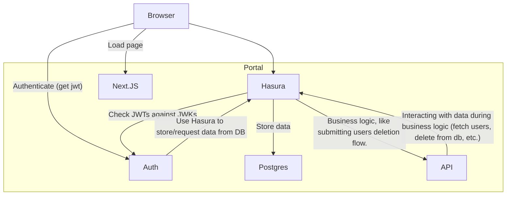
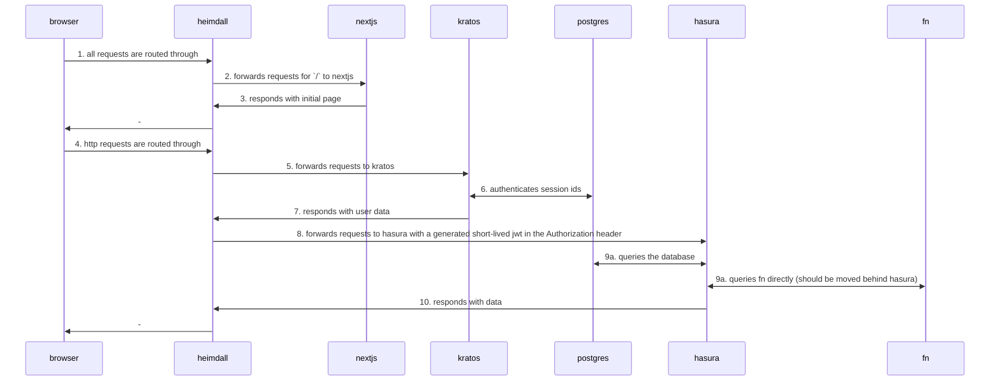

# Defang Portal

## Local Dev

Ideally, run this in a devcontainer. VSCode should prompt you to do so. Otherwise you'll need to make sure you install the Hasura CLI and pnpm.

There is a workspace at `./portal.code-workspace`. Once you start the devcontainer, open this workspace. (you should be prompted to do so). The workspace will recommend a few extensions, and will immediately start the project, which consists of the following steps:

- Install backend dependencies
  Note: this is done this way because we mount the `fn` (api) directory into the container for live reloading. A bit hacky, but works. (Runs `docker compose run --rm api install`)
- Start the backend (Runs `docker compose up`)
- Start the Hasura console, and checks for the backend being up and hasura being healthy before starting. (Essentially runs `hasura console`)
- Install frontend dependencies
- Start the frontend in dev mode (Runs `npm dev`)

If you need to start the process yourself, can run them all manually by searching for the "run task" command in VSCode and running the following tasks:

- `backend: run dev`
- `hasura: console`
- `web: run dev`

Once the frontend is running, you can access the site at `http://localhost:3000`.

## Auth

We're using a [Defang fork of OpenAUTH](https://github.com/DefangLabs/openauth). We merge our own features into a branch called `defang` in that repo, which is pulled into a git subtree at `/auth/openauth` in this repo. To update the auth code, you can run `git subtree pull --prefix auth/openauth https://github.com/DefangLabs/openauth defang`

## Secrets

- `defang-portal:githubClientSecret`: created in GitHub settings, OAuth Apps
- `defang-portal:gitlabClientSecret`: created in GitLab preferences, Applications
- `defang-portal:hasuraAdminSecret`:
- `defang-portal:stripeSecretKey`: from Stripe dashboard

## Deploy

**Do not deploy to prod from your local machine. Let the CI take care of it.**

## Architecture

### Dependency graph:

### Abstract request sequence:

### Tenants

We pass the tenant ID in the `X-Defang-Tenant-Id` header. See
[docs/tenants.md](docs/tenants.md) for a detailed overview of how tenant
management works inside the portal.

### Feature Flags

Feature flags are client-side only and can be toggled via query parameters or
`localStorage`. Refer to [docs/feature-flags.md](docs/feature-flags.md) for usage
instructions.
