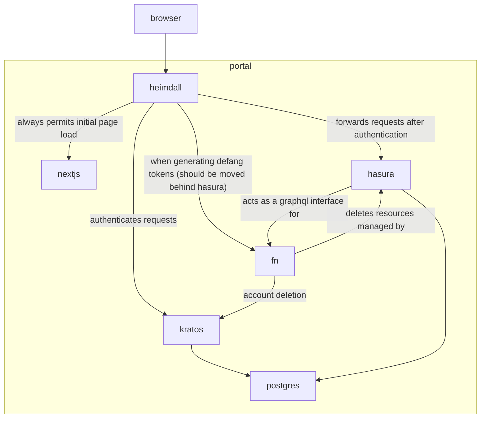
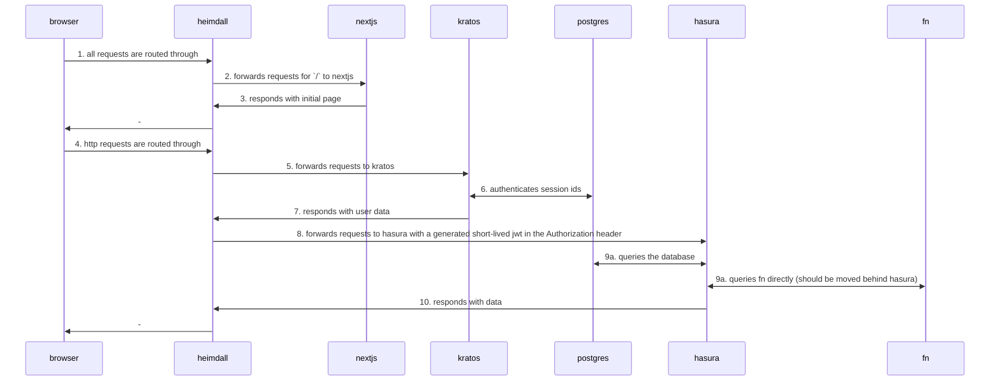

# Defang Portal

## Local Dev

Ideally, run this in a devcontainer. VSCode should prompt you to do so. Otherwise you'll need to make sure you install the Hasura CLI and pnpm.

There is a workspace at `./portal.code-workspace`. Once you start the devcontainer, open this workspace. (you should be prompted to do so). The workspace will recommend a few extensions, and will immediately start the project, which consists of the following steps:

 - Install backend dependencies
   Note: this is done this way because we mount the `fn` (api) directory into the container for live reloading. A bit hacky, but works. (Runs `docker compose run --rm fn install`)
 - Start the backend (Runs `docker compose up`)
 - Start the Hasura console, and checks for the backend being up and hasura being healthy before starting. (Essentially runs `hasura console`)
 - Install frontend dependencies
 - Start the frontend in dev mode (Runs `pnpm dev`)

If you need to start the process yourself, can run them all manually by searching for the "run task" command in VSCode and running the following tasks:

 - `backend: run dev`
 - `hasura: console`
 - `web: run dev`

Once the frontend is running, you can access the site at `http://localhost:8000`.

### NOTES

All services are designed run behind Heimdall, which is a reverse proxy that handles authorization. This includes the web service, so if you go to localhost:3000, the app won't work properly (even though you will see a login UI). You must go to localhost:8000 to access the app.

Hot reloading for Next.js doesn't work at the moment, because we're running an old version of Heimdall which doesn't support websockets. We should upgrade Heimdall to the latest version to fix this.


## Secrets
- `aiven:apiToken`: created in Aiven dashboard; this expires when unused for 10 hours; **deprecated** use `AIVEN_TOKEN` env
- `defang-portal:aivenBillingGroup`: from Aiven dashboard
- `defang-portal:githubClientSecret`: created in GitHub settings, OAuth Apps
- `defang-portal:hasuraAdminSecret`:
- `defang-portal:hasuraDatabasePassword`:
- `defang-portal:kratosDatabasePassword`:
- `defang-portal:kratosSecretsCipher0`: random 32 char string (24 bytes, base64 encoded)
- `defang-portal:kratosSecretsCookie0`: random 32 bytes, base64 encoded to 44 chars
- `defang-portal:stripeSecretKey`: from Stripe dashboard

## Deploy

Create an Aiven API token using their dashboard. Then run the following command to deploy the stack:
```
AIVEN_TOKEN=… pulumi -C pulumi up
```
**Do not deploy to prod from your local machine. Let the CI take care of it.**

## Architecture

### Dependency graph:



### Abstract request sequence:


